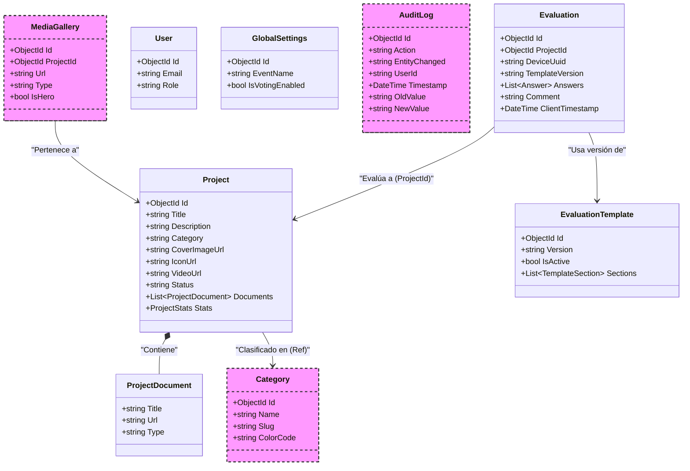

# Modelo de Datos del Kiosco de Evaluación

Este documento detalla la estructura lógica de los datos (Entidades) implementadas en el Backend (.NET/MongoDB).

## Diagrama de Clases (UML)

## Diccionario de Datos

### 1. `Project` (Proyecto)
Representa un proyecto expuesto en el kiosco.
- **Videos:** Se almacenan en el campo `VideoUrl`.
- **Documentos:** Lista de archivos adjuntos (PDFs, PPTs) en la colección `Documents`.
- **Multimedia:** `CoverImageUrl` (Portada) e `IconUrl` (Logotipo).

### 2. `Evaluation` (Reseña/Voto)
Representa la evaluación realizada por un usuario.
- **Reseña:** El campo `Comment` almacena la opinión textual del usuario.
- **Puntuación:** La lista `Answers` contiene los valores numéricos de cada pregunta.

### 3. `ProjectDocument` (Documento)
Clase anidada dentro de `Project` para manejar archivos adjuntos.
- `Type`: Puede ser "pdf", "enlace", "resumen", etc.

## Entidades Futuras (Planificadas) - Fase 2

Estas entidades están definidas en los requerimientos pero se implementarán en la siguiente fase de desarrollo.

### 4. `AuditLog` (Historial de Cambios)
*Requerimiento: RF-WEB-15 / RF-BACK-15*
Registro inmutable de todas las acciones administrativas (creación, edición, eliminación) para fines de seguridad y auditoría.
- **Action:** Tipo de cambio (CREATE, UPDATE, DELETE).
- **EntityChanged:** Qué se modificó (ej. "Project: 123").
- **OldValue/NewValue:** Snapshots para revertir cambios.

### 5. `Category` (Categoría)
*Requerimiento: RF-FRONT-03*
Actualmente el campo `Category` en `Project` es un string simple. En el futuro, se normalizará a su propia colección para permitir:
- Gestión dinámica de categorías desde el Dashboard.
- Asignación de colores (`ColorCode`) para los filtros de la UI.

### 6. `MediaGallery` (Galería Multimedia Avanzada)
*Requerimiento: RF-FRONT-01 / RF-BACK-02*
Aunque `Project` ya tiene `VideoUrl` e `ImageCoverUrl`, esta entidad permitirá:
- Múltiples videos o imágenes por proyecto.
- Marcar un recurso específico como "Hero" (Principal).
- Metadatos adicionales (Créditos, Leyendas).
